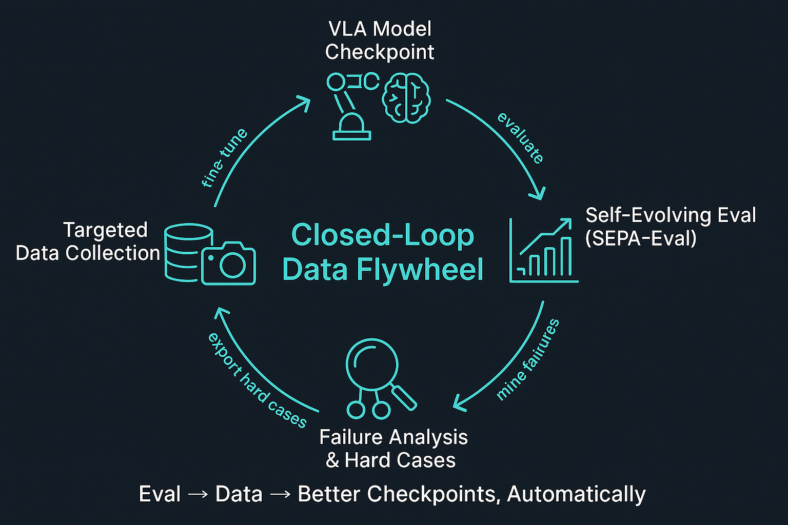
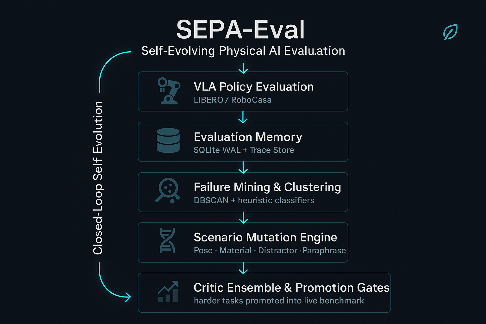

<div align="center">


# SEPA-Eval

### Self-Evolving Physical AI Evaluation

[](AlphaBrain/LICENSE)
[](https://www.python.org/)
[](AlphaBrain/README.md)
[](paper/main.pdf)

<p align="center">
  
</p>

**SEPA-Eval** turns a static VLA benchmark into a living one. It records rollout failures, clusters them, mutates the worst-case scenarios into harder variants, validates them through a critic ensemble, and automatically promotes them into the active benchmark distribution — closing the loop between evaluation and continual learning.

[Architecture](#architecture) · [Installation](#installation) · [Quick Start](#quick-start) · [CLI Reference](#cli-reference) · [Demo](#customer-demo-workflow) · [Paper](#citation)

</div>

---

## The Problem with Static Benchmarks

| Problem | What Happens |
|---|---|
| **Saturation** | Frontier models exceed 95%+ SR on LIBERO; the benchmark stops discriminating |
| **Misalignment** | Binary success rate misses fragile success, unsafe contact, and brittle grasp recovery |
| **Silent drift** | Scores look meaningful long after they stop predicting real deployment behavior |

SEPA-Eval solves all three by making the benchmark itself a first-class output of the evaluation process.

---

## Key Capabilities

- **Structured trace recording** — every episode emits observations, actions, contact events, success labels, and detected failure moments to a crash-safe SQLite + msgpack store
- **Failure mining** — heuristic detectors (timeout, out-of-reach, grasp, contact dynamics, recovery, pose, distractor, language) feed into DBSCAN clustering over compact trace embeddings
- **Scenario mutation** — pose perturbation, material swap, distractor injection, instruction paraphrase, and horizon extension operators generate harder task candidates from failure seeds
- **Critic ensemble** — semantic critic (VLM judge), safety critic (force/collision heuristics), and robustness critic score each candidate independently
- **Promotion pipeline** — async gate execution with configurable timeouts; evidence recorded per task; human review queue for borderline decisions
- **Hard-case export** — failed episodes exported as `jsonl` or LeRobot-style parquet datasets, ready for AlphaBrain's continual learning pipeline
- **Self-evolution loop** — a single orchestrator command runs the full Evaluate → Diagnose → Generate → Validate → Promote → Report cycle

---

## Architecture

<p align="center">
  
</p>

The closed-loop pipeline runs six stages on every evolution cycle:

1. **Evaluate** — run VLA policies on the current benchmark distribution (LIBERO / RoboCasa) via AlphaBrain's WebSocket eval harness; record structured rollout traces
2. **Diagnose** — classify failures by type and cluster traces with DBSCAN to extract reproducible failure seeds
3. **Generate** — apply mutation operators to failure seeds to produce harder task candidates
4. **Validate** — score candidates through the critic ensemble; defer on timeout rather than hard-fail
5. **Promote** — admit candidates that clear all gates into the live benchmark distribution; log evidence per task
6. **Report** — surface capability frontiers, saturation signals, and model comparison across evolved benchmark slices

### Package Structure

```
AlphaBrain/sepa_eval/
  hooks/          BenchmarkAdapter protocol + LiberoHook, RobocasaHook
  memory/         EvalMemory (SQLite WAL + msgpack trace store), schema
  mining/         FailureStepDetector, DBSCAN clustering, seed extraction, LLM summarizer
  mutation/       PosePerturbation, MaterialSwap, DistractorAdd, InstructionParaphrase, HorizonExtension
  critics/        Semantic critic (VLM), safety critic, robustness critic
  promotion/      Validation pipeline, promotion gates, human review queue
  orchestrator/   Self-evolution loop
  exporter/       Hard-case dataset export (jsonl + LeRobot parquet)
  registry/       models.yaml-backed model registry + DB sync
  reporting/      Markdown report generation, task-model heatmaps
  configs/        mutation.yaml, orchestrator defaults, model configs
  tests/          Unit and integration tests
```

---

## Installation

### SEPA-Eval package only

The `sepa_eval` package lives inside `AlphaBrain/`. Install from that subdirectory.

```bash
python -m venv .venv && source .venv/bin/activate
pip install -e ./AlphaBrain
pip install -e "./AlphaBrain[dev]"   # adds black, ruff, pre-commit
pip install msgpack scikit-learn jinja2 pyyaml openai pyarrow pytest
```

| Optional package | Required for |
|---|---|
| `msgpack` | Trace persistence (required) |
| `scikit-learn` | Failure clustering |
| `jinja2` | Templated report rendering |
| `pyyaml` | Config and model registry loading |
| `openai` | Instruction paraphrase mutation operator |
| `pyarrow` | LeRobot-style parquet export |
| `pytest` | Running the test suite |

### Full benchmark setup (LIBERO + RoboCasa)

Running SEPA-Eval against real simulators requires three separate Python environments and several dataset downloads. See **[SETUP.md](SETUP.md)** for the complete step-by-step guide covering:

- AlphaBrain conda environment
- LIBERO simulator installation and data preparation
- RoboCasa Tabletop environment (robosuite 1.5.1 + tabletop fork + assets)
- RoboCasa 365 environment
- `.env` variable reference with correct path conventions
- Verification commands and common pitfalls

---

## Quick Start

All commands run from the `AlphaBrain/` directory.

### 1. Check memory status

```bash
python -m sepa_eval --memory-dir ../eval_memory status
```

### 2. Register / sync models

```bash
python -m sepa_eval --memory-dir ../eval_memory sync-models
```

### 3. Run the evolution loop

```bash
python -m sepa_eval --memory-dir ../eval_memory run
```

### 4. Generate a Markdown report

```bash
python -m sepa_eval --memory-dir ../eval_memory report --output ../eval_memory/report.md
```

### 5. Review pending promotion candidates

```bash
python -m sepa_eval --memory-dir ../eval_memory review list
python -m sepa_eval --memory-dir ../eval_memory review approve <task_id>
```

---

## CLI Reference

| Command | Description |
|---|---|
| `run` | Run the full closed-loop evolution cycle |
| `eval` | Register a model and run CI-style evaluation checks |
| `promote` | Run the promotion pipeline on pending candidates |
| `report` | Generate a Markdown report with heatmaps |
| `export-hard-cases` | Export failed episodes as a training dataset |
| `diff` | Compare task-level success rates between two models |
| `sync-models` | Sync `configs/models.yaml` into the database |
| `prune` | Remove old trace files while preserving DB rows |
| `review list` | List candidates awaiting human review |
| `review approve` | Promote a candidate manually |
| `status` | Show memory statistics and evolution metrics |

Default storage root: `SEPA_MEMORY_DIR` env var, or `./eval_memory/`.

---

## Wiring into an AlphaBrain Eval Run

```python
from sepa_eval.hooks.libero_trace_hook import run_libero_episode_with_trace
from sepa_eval.memory.eval_memory import EvalMemory
from sepa_eval.memory.schema import TraceIdentity

memory = EvalMemory(
    db_path="../eval_memory/eval.db",
    memory_dir="../eval_memory/traces",
)

trace = run_libero_episode_with_trace(
    env=libero_env,
    policy_fn=policy_fn,
    memory=memory,
    identity=TraceIdentity(
        trace_id="trace-001",
        eval_run_id="run-001",
        benchmark="libero_spatial",
        task_id="pick_red_cup",
        task_instruction="pick up the red cup",
        model_id="alphabrain-v2",
        model_version="v2.1",
    ),
)
```

RoboCasa: replace `libero_trace_hook` with `robocasa_trace_hook` and `run_robocasa_episode_with_trace`.

---

## Customer Demo Workflow

A deterministic, simulator-free walkthrough using synthetic traces.

### 1. Generate synthetic traces

```bash
cd AlphaBrain
python ../demo/generate_libero_traces.py --output-dir ../demo/demo_eval_memory
```

### 2. Run the guided demo

```bash
cd demo
./run_customer_demo.sh               # interactive, pauses between stages
./run_customer_demo.sh --no-pause    # fully automatic
./run_customer_demo.sh --regenerate  # rebuild traces first
```

### 3. Open the HTML dashboard

```bash
python demo/render_report_html.py \
  --input  demo/output/report.md \
  --output demo/output/report.html
open demo/output/report.html
```

Artifacts produced: `demo/output/report.md`, `demo/output/report.html`, `demo/demo_eval_memory/` (SQLite + msgpack traces).

---

## Development and Testing

```bash
# Run all SEPA-Eval tests
cd AlphaBrain
pytest sepa_eval/tests -v

# Lint
ruff check .
black --check .
```

Test coverage includes: memory and trace persistence, critics, mutation operators, failure classification and clustering, promotion pipeline, exporter, registry, and integration-level flows.

---

## Current Status

**Implemented and test-covered:**
- Trace hooks and benchmark adapters (LIBERO, RoboCasa)
- Persistent memory (SQLite WAL + msgpack) with crash-safe writes
- Failure classification, clustering, and seed extraction
- Full mutation operator suite (5 operators)
- Promotion gates + async pipeline with evidence recording
- Orchestrator loop, metrics output, and review CLI
- Reporting, hard-case export, and model registry

**Pending / in progress:**
- Long-term storage migration beyond SQLite (ANN indexing for large trace volumes)
- Simulator-specific validation (LIBERO state replay, RoboCasa material override fidelity)
- Full end-to-end evolution loop verified against a live simulator

See [TODOS.md](TODOS.md) for the detailed implementation checklist.

---

## Citation

If you use SEPA-Eval in your research, please cite:

```bibtex
@article{alchedata2026sepa,
  title   = {Self-Evolving Agents for Physical AI Evaluation},
  author  = {Alchedata},
  year    = {2026},
  note    = {White paper. \url{https://github.com/alchedata/sepa-eval}}
}
```

---

## Repository Layout

```
.
├── AlphaBrain/              AlphaBrain VLA framework + sepa_eval package
│   └── sepa_eval/           SEPA-Eval implementation
├── demo/                    Synthetic trace generator and HTML dashboard renderer
├── paper/                   ACM acmart white paper source
├── assets/                  Diagrams and logos
├── PRD_SEPA_VLA_Eval.md     Product and system specification
└── TODOS.md                 Implementation status tracker
```

---

## License

SEPA-Eval is released under the [MIT License](AlphaBrain/LICENSE).

---

<div align="center">


**[Alchedata](https://alchedata.com)** — DATA INFRA 2.0 for Physical AI

*Closed-loop eval → data → better checkpoints, automatically.*

</div>
